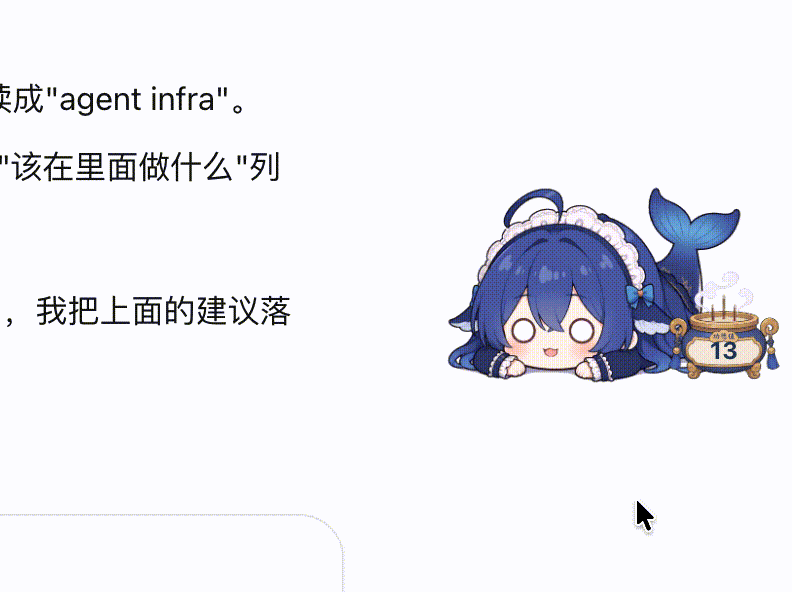
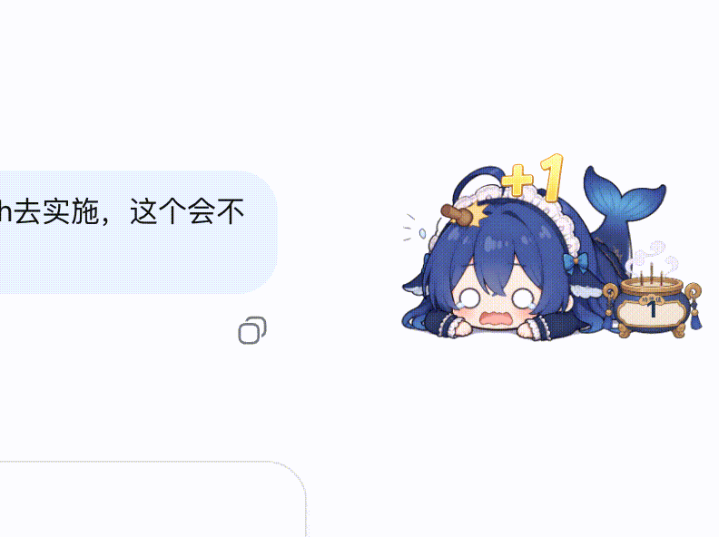

# dsh-muyu

[](https://awesome-dsh-plugin.com)

中文 | [English](README.en.md)

Harness 还是 preview 版本，最近算力不够，感觉api也有点降速，loop 有时说断就断。等loop的过程有时候好几分钟，我这个气呀，做了个右下角不争气的小肥鲸，敲一下记一功德，等待的时候敲敲她吧，希望deepseek算力中心早点建起来，梁叔叔再把模型价格打下来。它忙的时候自己也会敲，挂机加功德了，没事摸摸鱼吧。

位于 Web 客户端右下角的电子木鱼：敲头记功德；模型在思考和流式输出时她会自己敲。功德只在本机浏览器，不进对话记录，也不会有额外请求。可以自己换喜欢的图。

| 手动敲 | 自动敲 |
| --- | --- |
|  |  |

## 玩法

- 点角色头部：+1 功德。被敲多了会起包。
- 当前会话忙碌时：自动轻敲，也记功德，默认大约每秒 1 功德。
- 换会话：功德只会记录当前会话的敲击次数与自动消耗，切换会显示当前会话的。
- 计数有香炉和木牌两种，默认香炉；9999 以内显示原数，再大显示 `Nk`。
- 系统开了「减少动态效果」时会跳过跳动和飘 +1。

手感与图源在 **设置 → 木鱼** 里改（开关、香炉/木牌、自动敲快慢、起包连击数、自定义图源前缀）。

## 安装

前提：本机已能跑 `dsh web`（DeepSeek Harness）。

### 从 npm 安装（推荐）

```bash
dsh plugin --profile web add dsh-muyu
dsh --profile web
```

重启 Web 客户端后，右下角应出现木鱼。包内已带构建产物，一般不用 `allowBuilds`。

### 从 GitHub 安装

```bash
dsh plugin --profile web add github:liuwenji007/dsh-muyu
dsh --profile web
```

pnpm ≥10 可能拦截 git 依赖的 `prepare`：第一次失败后，把 pnpm 打印的包名写进该 profile 的 `pnpm-workspace.yaml`：

```yaml
allowBuilds:
  dsh-muyu: true
```

再执行一次 `add`。建议钉 commit：`github:liuwenji007/dsh-muyu#<sha>`。

### 本地链接（开发调试）

```bash
cd /你的路径/dsh-muyu
pnpm install
dsh plugin --profile web add link:/你的路径/dsh-muyu
dsh --profile web
```

### 验证与卸载

- 生效：右下角出现木鱼；或 `dsh --profile web --dump-config` 里能看到本包。刷新页面不够，要重启 `dsh web` / `dsh --profile web`。
- 卸载：`dsh plugin --profile web remove dsh-muyu`，再重启。

### 排障

| 碰到 | 怎么处理 |
| --- | --- |
| 右下角出现两只 | 组合包可能已有内置 `ui-muyu`。在 profile 的 `cordis.patch.yml` 里加 `- id: ui-muyu` / `disabled: true` |
| git 安装卡在 `allowBuilds` | 见上文「从 GitHub 安装」 |
| 也可用 `.tgz` | `pnpm pack` 后：`dsh plugin add ./dsh-muyu-0.1.0.tgz` |

## 设置

| 项 | 默认 | 说明 |
| --- | --- | --- |
| 显示浮层 | 开 | 关掉只藏角色，设置页还在 |
| 功德牌 | 香炉 | 香炉或木牌 |
| 忙碌后第一次自动敲 | 1000 ms | |
| 自动敲间隔 | 1000 ms | |
| 大包连击阈值 | 5 | 达到后松手先大包，有消包图则消包再笑脸，否则小包 |
| 自定义图源前缀 | （空） | 填 CDN/静态目录 URL，留空用内置图 |

图源目录里需要这些文件名：`idle.png`、`auto-hit.png`、`manual-hit.png`、`bump.png`、`bump-big.png`、`stick.png`、`board.png`、`censer.png`、`add.png`。`bump-recover.png` 可选：有则大包后先消包再回笑脸，没有则仍走小包。改完即时生效，不用重新安装插件。

在 **设置 → 木鱼 → 导出官方图包** 可下载同名 zip，改图后上传到任意静态托管，把目录 URL 填回「自定义图源前缀」即可分享二创皮肤。

起包停留、自动敲姿势时长、木棍光标热点跟默认图绑在一起，改 [`src/config.ts`](src/config.ts) 里的 `ART_TUNABLES` 后重新 `pnpm run build`。

## 注意

- 功德记在本机 `localStorage`（`dsh.muyu.merit`），最多 100 个最近敲过的会话；删掉的对话不会跟着清。隐私模式或配额满了，只是本页不再保存。
- 不能拖拽，以免挡住侧栏。
- 也可以直接改仓库里的 `src/client/assets/` 再 build，适合做成新默认皮肤发布。

## 改这个仓库

```bash
pnpm install
pnpm test
pnpm run build
```

MIT
